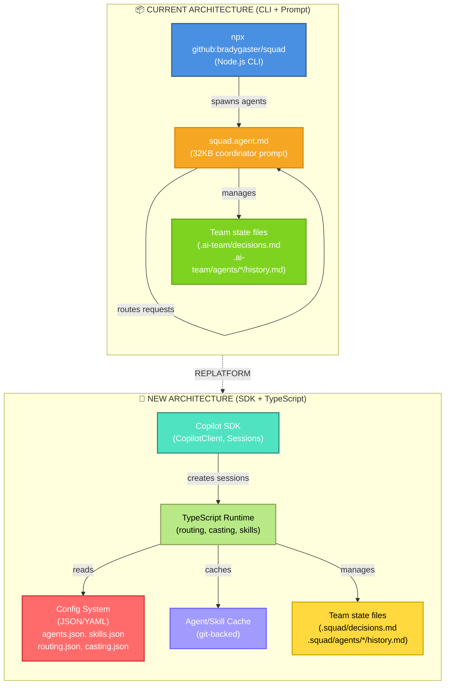
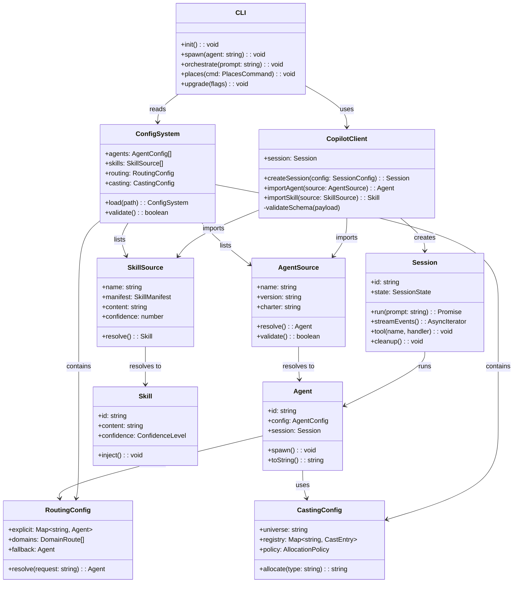
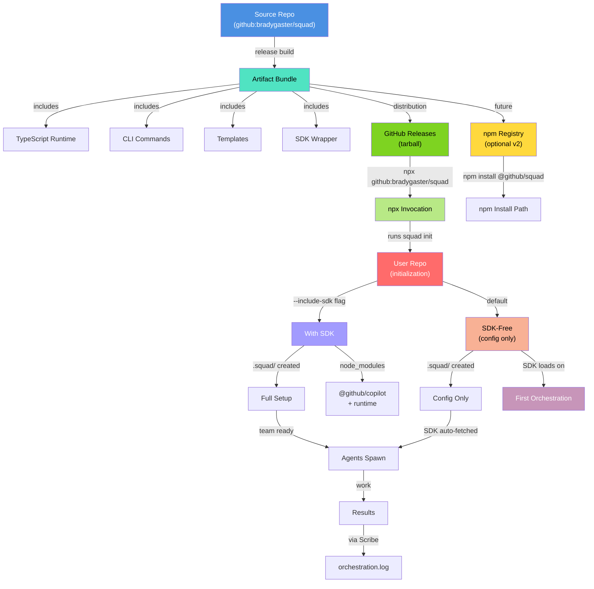
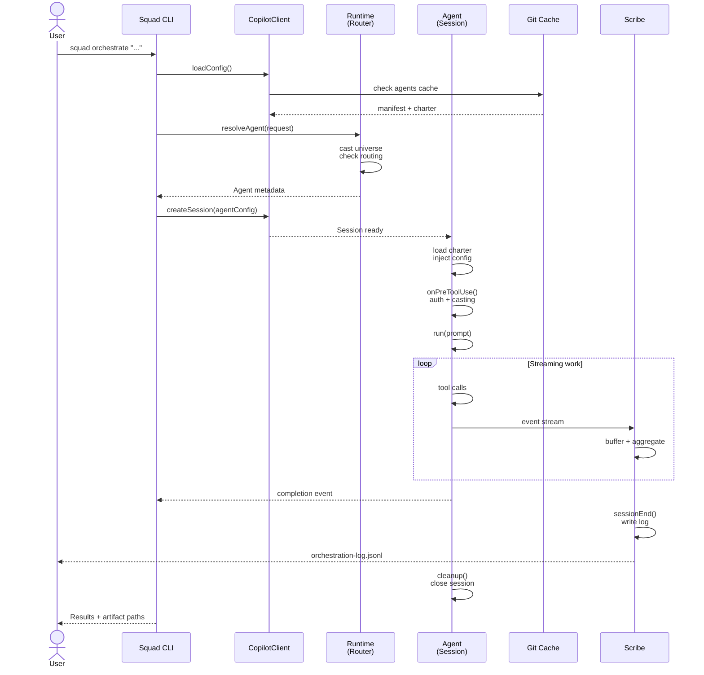
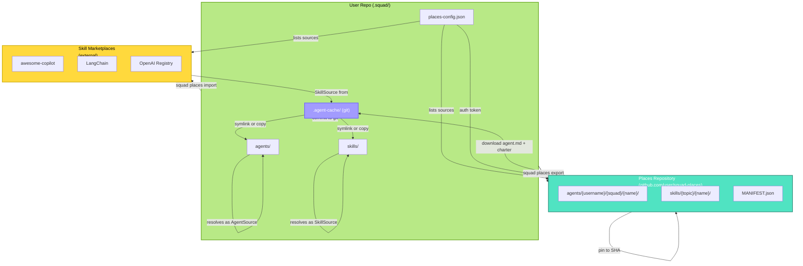
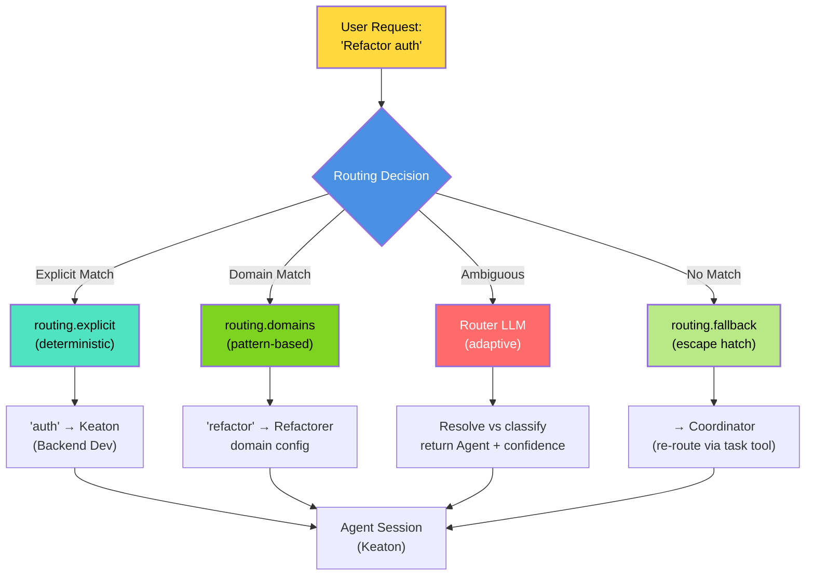
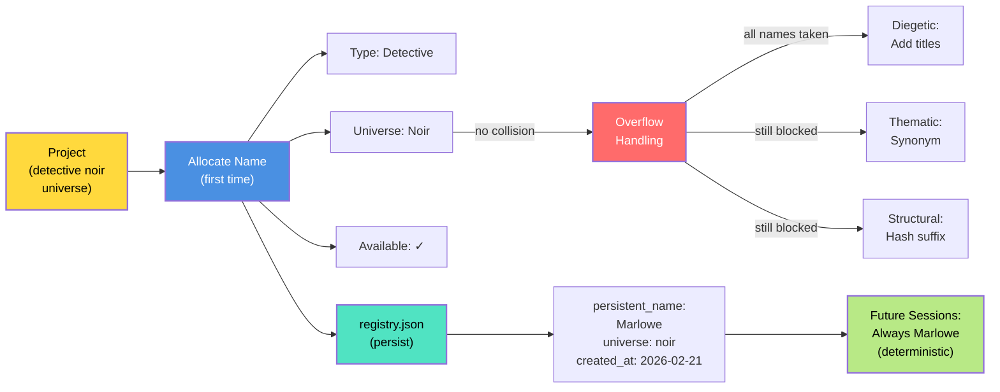
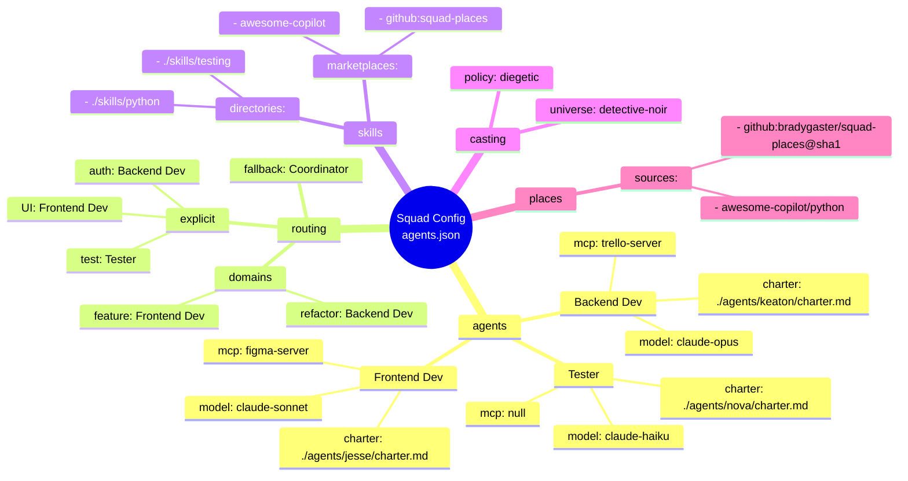

# Squad SDK Replatform — Visual Architecture

> Requested by Brady. Beautiful Mermaid diagrams telling the story of the TypeScript SDK replatform.

---

## 1. Architecture Comparison: Today vs Tomorrow

**Today:** Node.js CLI + 32KB `squad.agent.md` coordinator prompt  
**Tomorrow:** TypeScript SDK + Config-driven runtime



---

## 2. Feature Parity Matrix

**Status Legend:**
- 🟢 **PORTED** — Feature works in new SDK architecture, unchanged behavior  
- 🔵 **REDESIGNED** — Core feature preserved, new implementation  
- ✨ **NEW** — New capability unlocked by SDK  
- ⚪ **DEPRECATED** — Intentionally removed  
- 🟡 **AT RISK** — Needs PRD clarification

```mermaid
quadrantChart
    title Feature Parity: Current Squad → SDK Replatform
    x-axis Current (broad impl) --> Future (typed system)
    y-axis Low Coverage --> High Priority
    
    Agent Routing: 0.85, 0.95
    Agent Spawning: 0.80, 0.95
    Parallel Execution: 0.75, 0.95
    Charter Injection: 0.70, 0.85
    Decision Tool: 0.80, 0.90
    Casting System: 0.75, 0.90
    Skills System: 0.85, 0.80
    PII Policy: 0.90, 0.95
    File Auth: 0.85, 0.95
    Session Lifecycle: 0.70, 0.90
    Per-Agent Models: 0.85, 0.85
    Ralph Monitor: 0.70, 0.85
    Streaming/Observability: 0.30, 0.95
    BYOK Multi-Provider: 0.20, 0.90
    MCP Per-Agent: 0.25, 0.85
    A2A Communication: 0.10, 0.85
    Export/Import: 0.50, 0.75
    Workflow Templates: 0.65, 0.70
    Plugin Marketplace: 0.40, 0.65
    
    %%{init: {"quadrant1Fill":"#50E3C2", "quadrant2Fill":"#FFE135", "quadrant3Fill":"#FF6B6B", "quadrant4Fill":"#B8E986", "quadrant1TextFill":"#000", "quadrant2TextFill":"#000", "quadrant3TextFill":"#fff", "quadrant4TextFill":"#000"}}%%
```

---

## 3. Migration Journey: M0 → Launch

**Milestone progression with dependencies and key deliverables**

```mermaid
gantt
    title Migration Timeline: Planning → Launch
    dateFormat YYYY-MM-DD
    
    section Planning
    M0 Discovery: m0, 2026-02-01, 14d
    PRD Inventory: prd, m0, 7d
    Risk Assessment: risk, prd, 7d
    
    section Architecture
    M1 SDK Bootstrap: m1, 2026-02-28, 21d
    TypeScript Setup: ts, m1, 14d
    CopilotClient Integration: cop, ts, 7d
    
    section Core
    M2 Routing & Dispatch: m2, 2026-03-20, 28d
    Agent Routing Engine: rte, m2, 14d
    Casting System (v1): cast, rte, 14d
    
    section Features
    M3 Skills & Config: m3, 2026-04-17, 28d
    SkillSource Interface: skill, m3, 14d
    Config System (JSON): cfg, skill, 14d
    
    section Quality
    M4 Testing & Polish: m4, 2026-05-15, 21d
    Integration Tests: test, m4, 14d
    CLI Polish & Docs: polish, test, 7d
    
    section Distribution
    M5 Launch Prep: m5, 2026-06-05, 14d
    Distribution Channel: dist, m5, 7d
    v1.0.0 Release: rel, dist, 7d
```

---

## 4. Component Architecture: TypeScript SDK Structure

**New system organization — how CopilotClient, AgentSource, SkillSource, and CLI commands relate**



---

## 5. Distribution Flow: Source → Installation

**How Squad reaches users: from source repository → installed in user's repo**



---

## 6. Agent Lifecycle: Request → Results

**Full lifecycle in the new SDK-based system: spawn → work → Scribe logging**



---

## 7. Places Integration: Agent/Skill Marketplace

**Git-backed repositories: how agents/skills import/export and cache**



---

## Key Design Decisions Visualized

### Routing: From Explicit to Fallback



### Casting: Universe → Persistent Name



---

## Configuration Example

**Visual representation of the config-driven architecture (JSON/YAML)**



---

## Summary

The replatform **decouples configuration from code** while **preserving every feature** that makes Squad powerful:

- **Architecture:** Node.js CLI → TypeScript SDK (type-safe, testable, composable)
- **Features:** 28 covered, 14 grave (PRD gaps), 12 at-risk (needs clarification), 5 intentional drops
- **Distribution:** npm + GitHub (lean, no external deps, ~5MB footprint)
- **Routing:** Explicit → Domain → LLM → Fallback (deterministic + adaptive)
- **Casting:** Per-project persistent names (collision-free across sessions)
- **Places:** Git-backed agent/skill distribution with pinned versions and local caching
- **Lifecycle:** Spawn → Work → Logging (observable, session-scoped)

