# Squad

**AI agent teams for any project.** A team that grows with your code.

[](#status)
[](#how-it-works)

---

## What is Squad?

Squad gives you an AI development team through GitHub Copilot. Describe what you're building. Get a team of specialists — frontend, backend, tester, lead — that live in your repo as files. They persist across sessions, learn your codebase, share decisions, and get better the more you use them.

It's not a chatbot wearing hats. Each team member runs in its own context, reads only its own knowledge, and writes back what it learned.

```mermaid
graph TB
    U["🧑‍💻 You"] -->|"Team, build the login page"| C["GitHub Copilot"]

    subgraph team [" 🏢 The Team "]
        direction LR
        A["🏗️ Lead"]
        K["⚛️ Frontend"]
        R["🔧 Backend"]
        T["🧪 Tester"]
    end

    C -->|spawns| A
    C -->|spawns| K
    C -->|spawns| R
    C -->|spawns| T
    C -.->|silent| S["📋 Scribe"]

    subgraph memory [" 🧠 Shared Memory "]
        direction LR
        D["decisions.md"]
        L["log/"]
    end

    A & K & R & T -->|read & write| D
    S -->|merges & logs| D
    S -->|writes| L

    A -->|learns| HA["history.md"]
    K -->|learns| HK["history.md"]
    R -->|learns| HR["history.md"]
    T -->|learns| HT["history.md"]

    style C fill:#6366f1,color:#fff
    style A fill:#3b82f6,color:#fff
    style K fill:#3b82f6,color:#fff
    style R fill:#3b82f6,color:#fff
    style T fill:#3b82f6,color:#fff
    style S fill:#6b7280,color:#fff
    style team fill:none,stroke:#3b82f6,stroke-width:2px,stroke-dasharray:5 5
    style memory fill:none,stroke:#8b5cf6,stroke-width:2px,stroke-dasharray:5 5
```



---

## Quick Start

### 1. Create your project

```bash
mkdir my-project && cd my-project
git init
```

### 2. Install Squad

```bash
npx bradygaster/squad
```

### 3. Open Copilot and go

```
copilot
```

Select **Squad** from the `/agents` list, then:

```
I'm starting a new project. Set up the team.
Here's what I'm building: a recipe sharing app with React and Node.
```

Squad proposes a team — each member named from a persistent thematic cast. You say **yes**. They're ready.

---

## Agents Work in Parallel — You Catch Up When You're Ready

Squad doesn't work on a human schedule. When you give a task, the coordinator launches every agent that can usefully start — simultaneously. Frontend, backend, tests, architecture — all at once.

```
You: "Team, build the login page"

  🏗️ Lead — analyzing requirements...          ⎤
  ⚛️ Frontend — building login form...          ⎥ all launched
  🔧 Backend — setting up auth endpoints...     ⎥ in parallel
  🧪 Tester — writing test cases from spec...   ⎥
  📋 Scribe — logging everything...             ⎦
```

When agents finish, the coordinator immediately chains follow-up work — tests reveal edge cases, the backend agent picks them up, no waiting for you to ask. If you step away, a breadcrumb trail is waiting when you get back:

- **`decisions.md`** — every decision any agent made, merged by Scribe
- **`orchestration-log/`** — what was spawned, why, and what happened
- **`log/`** — full session history, searchable

**Knowledge compounds across sessions.** Every time an agent works, it writes lasting learnings to its `history.md`. After a few sessions, agents know your conventions, your preferences, your architecture. They stop asking questions they've already answered.

| | 🌱 First session | 🌿 After a few sessions | 🌳 Mature project |
|---|---|---|---|
| ⚛️ **Frontend** | Project structure, framework choice | Component library, routing, state patterns | Design system, perf patterns, a11y conventions |
| 🔧 **Backend** | Stack, database, initial endpoints | Auth strategy, rate limiting, SQL preferences | Caching layers, migration patterns, monitoring |
| 🏗️ **Lead** | Scope, team roster, first decisions | Architecture trade-offs, risk register | Full project history, tech debt map |
| 🧪 **Tester** | Test framework, first test cases | Integration patterns, edge case catalog | Regression patterns, coverage gaps, CI pipeline |
| 📋 **Scribe** | First session logged | Cross-team decisions propagated | Full searchable archive of every session and decision |

Each agent's knowledge is personal — stored in its own `history.md`. Team-wide decisions live in `decisions.md`, where every agent reads before working. The more you use Squad, the less context you have to repeat.

**And it's all in git.** Anyone who clones your repo gets the team — with all their accumulated knowledge.

---

## How It Works

### The Key Insight

Each agent gets its **own context window**. The coordinator is thin. Each agent loads only its charter + history. No shared bloat.

### Context Window Budget

Real numbers. No hand-waving.

| What | Tokens | % of 128K context | When |
|------|--------|-------------------|------|
| **Coordinator** (squad.agent.md) | ~1,900 | 1.5% | Every message |
| **Agent at Week 1** (charter + seed) | ~850 | 0.7% | When spawned |
| **Agent at Week 4** (+ 15 learnings, 8 decisions) | ~1,900 | 1.5% | When spawned |
| **Agent at Week 12** (+ 50 learnings, 47 decisions) | ~5,600 | 4.4% | When spawned |
| **Remaining for actual work** | **~120,000** | **94%** | Always |

The coordinator uses 1.5% of context. A 12-week veteran agent uses 4.4%. That leaves **94% of the context window for reasoning about your code** — not for remembering who it is.

### Memory Architecture

| Layer | What | Who writes | Who reads |
|-------|------|-----------|-----------|
| `charter.md` | Identity, expertise, voice | Squad (at init) | The agent itself |
| `history.md` | Project-specific learnings | Each agent, after every session | That agent only |
| `decisions.md` | Team-wide decisions | Any agent | All agents |
| `log/` | Session history | Scribe | Anyone (searchable archive) |

---

## What Gets Created

```
.ai-team/
├── team.md              # Roster — who's on the team
├── routing.md           # Routing — who handles what
├── decisions.md         # Shared brain — team decisions
├── casting/
│   ├── policy.json      # Casting configuration
│   ├── registry.json    # Persistent name registry
│   └── history.json     # Universe usage history
├── agents/
│   ├── {name}/          # Each agent gets a persistent cast name
│   │   ├── charter.md   # Identity, expertise, voice
│   │   └── history.md   # What they know about YOUR project
│   ├── {name}/
│   │   ├── charter.md
│   │   └── history.md
│   └── scribe/
│       └── charter.md   # Silent memory manager
└── log/                 # Session history
```

**Commit this folder.** Your team persists. Names persist. Anyone who clones gets the team — with the same cast.

---

## Growing the Team

### Adding Members

```
> I need a DevOps person.
```

Squad generates a new agent, seeds them with project context and existing decisions. Immediately productive.

### Removing Members

```
> Remove the designer — we're past that phase.
```

Agents aren't deleted. Their charter and history move to `.ai-team/agents/_alumni/`. Knowledge preserved, nothing lost. If you need them back later, they remember everything.

---

## Reviewer Protocol

Team members with review authority (Tester, Lead) can **reject** work. On rejection, the reviewer may require:

- A **different agent** handles the revision (not the original author)
- A **new specialist** is spawned for the task

The Coordinator enforces this. No self-review of rejected work.

---

## Install

```bash
npx bradygaster/squad
```

See [Quick Start](#quick-start) for the full walkthrough.

---

## Status

🟣 **Experimental.** Contributors welcome.

Conceived by [@bradygaster](https://github.com/bradygaster).
